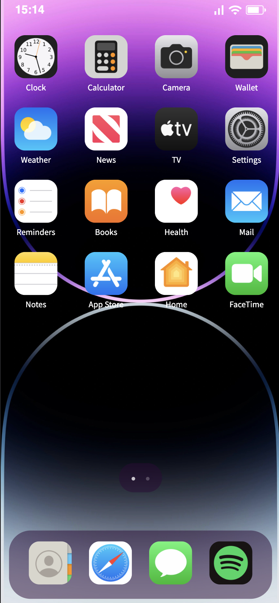

# Iphone Simulator

## Live Demo:

[Link](https://iphonesimulator.netlify.app/)

## The app is still in early development

A small project that I have been working on to build an Iphone clone on the web using React Js

## As of right now The only apps that are working are:

- The Camera App
- The Calculator App

## Screenshots:

